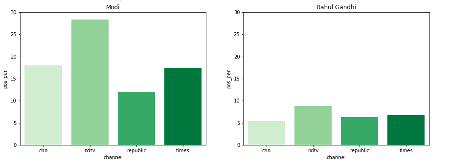
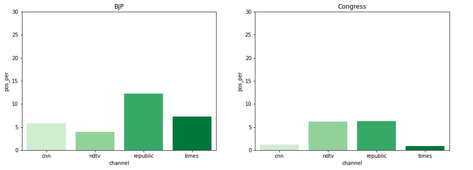
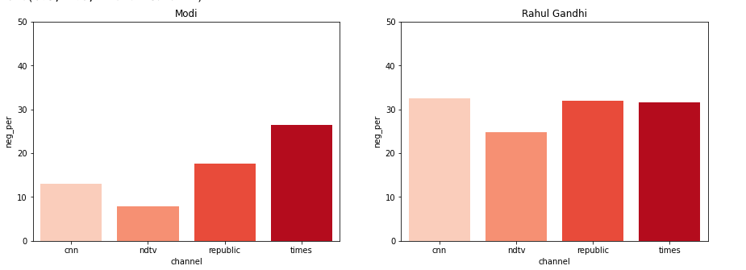
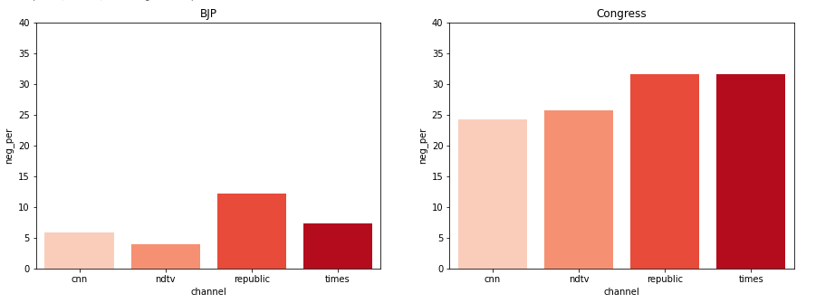

# Media-Bias-on-Twitter-using-Sentiment-Analysis-BERT-

In the following Notebook we identify the bias present in media towards any specific political party or person in India. By scrapping the latest tweets  from the top News Channels of India.
* NDTV
* Republic TV
* Times Now
* CNN News-18

## Dataset

The dataset used to train the bert model is [Tweet Sentiment Extraction](https://www.kaggle.com/c/tweet-sentiment-extraction).

And then the model is used to predict the sentiments of the scrapped tweets. Whether any tweet's sentiment is **Positive / Negative or Neutral**.

## Model
I have used the pretrained **Bert base-uncased** model for Sentiment analysis which can found on [Hugging Face](https://huggingface.co/transformers/model_doc/bert.html) library.

## Results
The following is the insights of the information present in the dataset, how one News Channel is biased towards any specific Political Party.

### Percentage Positive tweets
> 
 Percentage of positive tweets out of total tweets.

  
  
  ### Percentage Negative tweets
>   
 Percentage of negative tweets out of total tweets.

  
  
